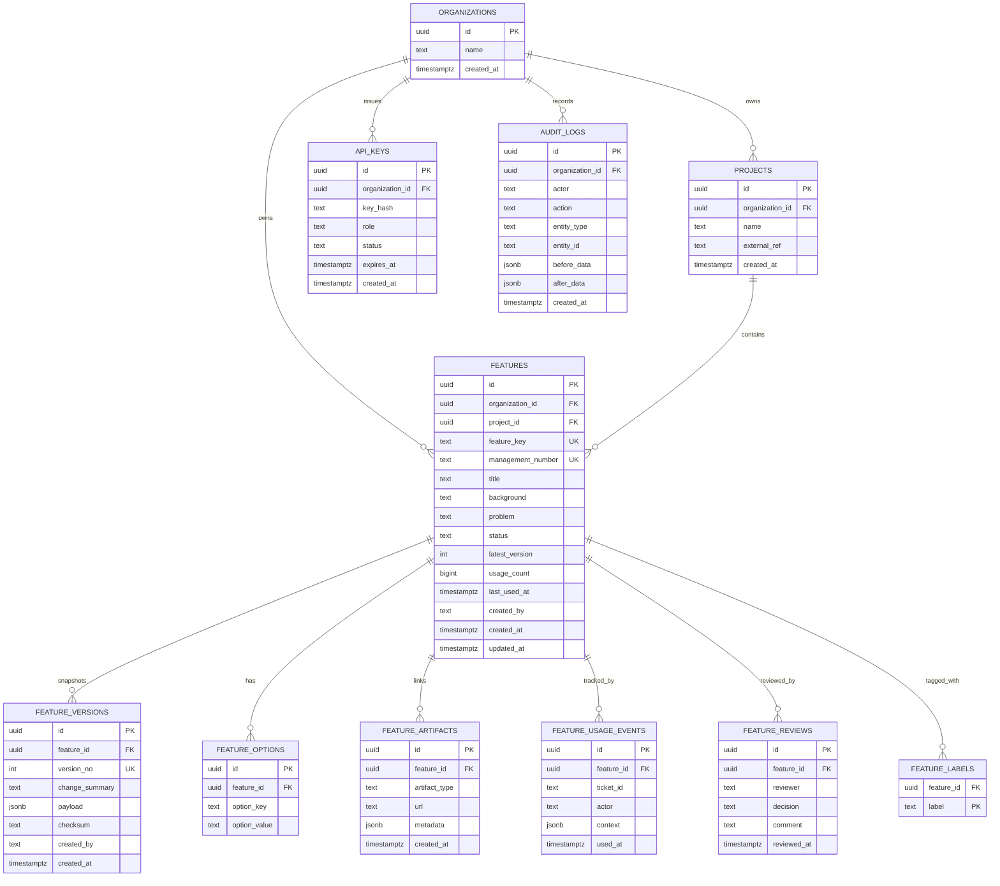

# F028 Appendix A - Feature SaaS ERD (Detailed)

## 목적

`F028-Feature-SaaS-Design.md`의 DB 설계를 ERD 관점으로 상세화한다.
이 문서는 구현 전 DB 설계 리뷰 기준 문서다.

## ERD (Mermaid)

## 정합성 규칙

1. `features(organization_id, feature_key)`는 유니크해야 한다.
2. `feature_versions(feature_id, version_no)`는 유니크해야 한다.
3. Feature 상태 변경/버전 생성/롤백은 `audit_logs`에 append 되어야 한다.
4. 조직 경계를 넘는 참조(FK)는 허용하지 않는다.

## 인덱스 권장

1. `idx_features_org_status_updated_at` on `(organization_id, status, updated_at desc)`
2. `idx_feature_versions_feature_version_no_desc` on `(feature_id, version_no desc)`
3. `idx_feature_usage_events_feature_used_at_desc` on `(feature_id, used_at desc)`
4. `idx_feature_labels_label` on `(label)`
5. `idx_audit_logs_org_created_at_desc` on `(organization_id, created_at desc)`

## 리뷰 체크리스트

1. 멀티테넌시 경계가 모든 FK에서 보장되는가?
2. 버전 충돌/중복 버전 생성 가능성이 차단되는가?
3. 검색/요약 쿼리 인덱스가 p95 목표를 지원하는가?
4. 감사 로그 누락 경로가 없는가?

## 상태

- 상태: Draft
- 작성일: 2026-02-15
