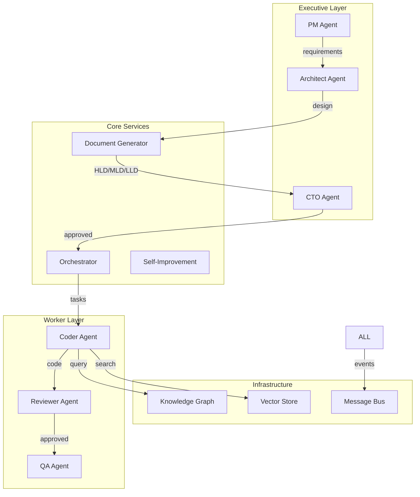

# Module & Feature Specification
## Autonomous Coding Agents - 상용 프로덕트 모듈/기능 정리

> 작성일: 2026-01-25
> 버전: 1.0
> 목적: VISION.md 구현을 위한 상용 프로덕트 수준의 모듈 및 기능 정의

---

## 1. Executive Summary

### 1.1 현재 상태 분석

| 영역 | 현재 구현율 | 목표 | Gap |
|------|------------|------|-----|
| Knowledge Layer | 5% | 90% | 85% |
| Feature Reuse | 0% | 80% | 80% |
| Document-Driven Dev | 0% | 100% | 100% |
| Agent Orchestration | 40% | 95% | 55% |
| Resilience | 20% | 95% | 75% |
| 24/7 Autonomous | 15% | 95% | 80% |
| Self-Improvement | 0% | 80% | 80% |
| Observability | 30% | 95% | 65% |
| Security | 25% | 90% | 65% |

### 1.2 핵심 모듈 구조

```
autonomous-coding-agents/
├── src/
│   ├── agents/                    # Agent Layer
│   │   ├── executive/             # 의사결정 에이전트
│   │   │   ├── cto-agent.ts
│   │   │   ├── pm-agent.ts
│   │   │   └── architect-agent.ts
│   │   ├── worker/                # 실행 에이전트
│   │   │   ├── coder-agent.ts     [기존]
│   │   │   ├── reviewer-agent.ts  [기존]
│   │   │   ├── qa-agent.ts        [신규]
│   │   │   └── devops-agent.ts    [신규]
│   │   └── base/                  # 공통 기반
│   │       ├── base-agent.ts      [기존]
│   │       └── types.ts           [기존]
│   │
│   ├── core/                      # Core Business Logic
│   │   ├── documents/             # Document-Driven Dev
│   │   │   ├── hld-generator.ts
│   │   │   ├── mld-generator.ts
│   │   │   └── lld-generator.ts
│   │   ├── orchestration/         # 워크플로우 관리
│   │   │   ├── task-router.ts
│   │   │   ├── workflow-engine.ts
│   │   │   └── dag-executor.ts
│   │   └── self-improvement/      # 자가 개선
│   │       ├── performance-analyzer.ts
│   │       ├── learning-system.ts
│   │       └── bug-self-fix.ts
│   │
│   ├── infrastructure/            # Infrastructure Layer
│   │   ├── knowledge/             # Knowledge Management
│   │   │   ├── neo4j-client.ts
│   │   │   ├── vector-store.ts
│   │   │   └── feature-reuse.ts
│   │   ├── resilience/            # 복원력
│   │   │   ├── retry-engine.ts
│   │   │   ├── circuit-breaker.ts
│   │   │   └── self-healing.ts
│   │   ├── messaging/             # 메시징
│   │   │   ├── nats-client.ts     [기존]
│   │   │   └── event-bus.ts
│   │   ├── observability/         # 관측성
│   │   │   ├── logger.ts
│   │   │   ├── metrics.ts
│   │   │   └── tracing.ts
│   │   └── security/              # 보안
│   │       ├── secrets.ts
│   │       ├── validation.ts
│   │       └── audit.ts
│   │
│   ├── operations/                # Operations Layer
│   │   ├── supervisor.ts
│   │   ├── cost-monitor.ts
│   │   └── scheduler.ts
│   │
│   └── api/                       # API Layer
│       ├── rest/
│       ├── websocket/
│       └── cli/
```

---

## 2. Module Specifications

### 2.1 Knowledge Layer Modules

#### 2.1.1 Neo4j Knowledge Graph Client

**목적**: 프로젝트 지식을 그래프 구조로 저장하고 쿼리

**핵심 기능**:
| 기능 | 설명 | 우선순위 |
|------|------|----------|
| Entity Storage | 코드 엔티티(파일, 클래스, 함수) 저장 | P0 |
| Relation Mapping | 의존성, 호출 관계, 상속 관계 매핑 | P0 |
| Pattern Query | 유사 패턴 검색 쿼리 | P0 |
| Decision History | 설계 결정 이력 추적 | P1 |
| Impact Analysis | 변경 영향도 분석 | P1 |

**데이터 모델**:
```cypher
// 노드 타입
(:Project {name, path, created})
(:File {path, language, size, hash})
(:Class {name, file, visibility})
(:Method {name, signature, complexity})
(:Decision {type, rationale, timestamp})

// 관계 타입
(File)-[:CONTAINS]->(Class)
(Class)-[:HAS_METHOD]->(Method)
(Method)-[:CALLS]->(Method)
(Class)-[:DEPENDS_ON]->(Class)
(Decision)-[:AFFECTS]->(File)
```

**인터페이스**:
```typescript
interface KnowledgeGraphClient {
  // Connection
  connect(config: Neo4jConfig): Promise<void>
  disconnect(): Promise<void>

  // Entity Operations
  storeEntity(entity: CodeEntity): Promise<string>
  updateEntity(id: string, updates: Partial<CodeEntity>): Promise<void>
  deleteEntity(id: string): Promise<void>

  // Relation Operations
  createRelation(from: string, to: string, type: RelationType, props?: object): Promise<void>
  findRelations(entityId: string, direction: 'in' | 'out' | 'both'): Promise<Relation[]>

  // Query Operations
  query(cypher: string, params?: object): Promise<QueryResult>
  findSimilarPatterns(pattern: CodePattern, limit?: number): Promise<Pattern[]>
  findDependencies(entityId: string, depth?: number): Promise<Dependency[]>

  // Impact Analysis
  analyzeImpact(entityId: string): Promise<ImpactReport>
}
```

#### 2.1.2 Vector Store (Semantic Search)

**목적**: 코드 임베딩 기반 시맨틱 검색

**핵심 기능**:
| 기능 | 설명 | 우선순위 |
|------|------|----------|
| Code Embedding | 코드를 벡터로 변환 | P0 |
| Semantic Search | 자연어로 코드 검색 | P0 |
| Similar Code Find | 유사 구현 찾기 | P0 |
| Batch Indexing | 대량 코드베이스 인덱싱 | P1 |
| Incremental Update | 변경분만 업데이트 | P1 |

**인터페이스**:
```typescript
interface VectorStore {
  // Indexing
  upsert(id: string, embedding: number[], metadata: CodeMetadata): Promise<void>
  batchUpsert(items: VectorItem[]): Promise<void>
  delete(ids: string[]): Promise<void>

  // Search
  search(query: number[], topK: number, filter?: FilterCondition): Promise<SearchResult[]>
  searchByText(text: string, topK: number, filter?: FilterCondition): Promise<SearchResult[]>

  // Maintenance
  getStats(): Promise<IndexStats>
  optimize(): Promise<void>
}

interface CodeMetadata {
  filePath: string
  language: string
  entityType: 'file' | 'class' | 'method' | 'function'
  name: string
  signature?: string
  docstring?: string
  lastModified: Date
}
```

#### 2.1.3 Feature Reuse Engine

**목적**: 기존 코드 재사용으로 개발 효율화

**핵심 기능**:
| 기능 | 설명 | 우선순위 |
|------|------|----------|
| Pattern Indexing | 코드 패턴 인덱싱 | P0 |
| Requirement Matching | 요구사항 ↔ 기존 코드 매칭 | P0 |
| Reuse Suggestion | 재사용 가능 코드 추천 | P0 |
| Duplicate Detection | 중복 코드 탐지 | P1 |
| Refactoring Suggest | 리팩토링 제안 | P1 |

**인터페이스**:
```typescript
interface FeatureReuseEngine {
  // Indexing
  indexCodebase(projectPath: string): Promise<IndexingResult>
  indexFile(filePath: string): Promise<void>

  // Matching
  findReusableCode(requirement: string): Promise<ReusableCode[]>
  findSimilarImplementations(code: string): Promise<SimilarCode[]>

  // Analysis
  detectDuplicates(threshold?: number): Promise<DuplicateGroup[]>
  suggestRefactoring(duplicates: DuplicateGroup[]): Promise<RefactoringSuggestion[]>

  // Metrics
  getReuseMetrics(): Promise<ReuseMetrics>
}

interface ReusableCode {
  filePath: string
  startLine: number
  endLine: number
  code: string
  similarity: number
  adaptationHints: string[]
}
```

---

### 2.2 Document-Driven Development Modules

#### 2.2.1 HLD (High-Level Design) Generator

**목적**: 요구사항 → 고수준 시스템 설계 자동 생성

**핵심 기능**:
| 기능 | 설명 | 우선순위 |
|------|------|----------|
| Requirement Analysis | 요구사항 구조화 분석 | P0 |
| Architecture Design | 시스템 아키텍처 설계 | P0 |
| Tech Stack Selection | 기술 스택 결정 | P0 |
| NFR Analysis | 비기능 요구사항 분석 | P0 |
| Risk Assessment | 리스크 평가 | P1 |
| Effort Estimation | 공수 추정 | P1 |

**출력 스키마**:
```typescript
interface HLDDocument {
  // Metadata
  id: string
  version: string
  createdAt: Date
  updatedAt: Date

  // Project Overview
  projectName: string
  projectDescription: string
  objectives: string[]
  scope: Scope
  constraints: Constraint[]

  // System Architecture
  architectureType: 'monolith' | 'microservices' | 'serverless' | 'hybrid'
  systemDiagram: MermaidDiagram
  components: Component[]
  dataFlow: DataFlowDiagram

  // Technology Stack
  technologyStack: TechStackDecision[]

  // Non-Functional Requirements
  nfr: {
    performance: PerformanceRequirement[]
    scalability: ScalabilityRequirement[]
    security: SecurityRequirement[]
    availability: AvailabilityRequirement[]
    maintainability: MaintainabilityRequirement[]
  }

  // Risk Assessment
  risks: Risk[]
  mitigations: Mitigation[]

  // Estimation
  estimatedEffort: EffortEstimate
  timeline: Milestone[]
}

interface TechStackDecision {
  category: 'language' | 'framework' | 'database' | 'messaging' | 'cloud' | 'tool'
  choice: string
  alternatives: string[]
  rationale: string
  tradeoffs: Tradeoff[]
}
```

#### 2.2.2 MLD (Module-Level Design) Generator

**목적**: HLD → 모듈별 상세 설계 분해

**핵심 기능**:
| 기능 | 설명 | 우선순위 |
|------|------|----------|
| Module Decomposition | 모듈 분해 | P0 |
| API Definition | API 인터페이스 정의 | P0 |
| Data Model Design | 데이터 모델 설계 | P0 |
| Dependency Mapping | 모듈간 의존성 | P0 |
| Test Strategy | 테스트 전략 | P1 |

**출력 스키마**:
```typescript
interface MLDDocument {
  // Metadata
  id: string
  hldReference: string
  moduleName: string
  version: string

  // Module Definition
  responsibilities: string[]
  boundaries: Boundary[]

  // Public API
  publicAPI: {
    endpoints?: RestEndpoint[]
    methods?: MethodSignature[]
    events?: EventDefinition[]
  }

  // Data Models
  dataModels: {
    entities: Entity[]
    valueObjects: ValueObject[]
    aggregates: Aggregate[]
  }

  // Dependencies
  dependencies: {
    internal: InternalDependency[]
    external: ExternalDependency[]
  }

  // Integration
  integrationPoints: IntegrationPoint[]

  // Testing
  testStrategy: {
    unitTests: TestStrategy
    integrationTests: TestStrategy
    contractTests: TestStrategy
  }
}
```

#### 2.2.3 LLD (Low-Level Design) Generator

**목적**: MLD → 구현 수준 상세 설계

**핵심 기능**:
| 기능 | 설명 | 우선순위 |
|------|------|----------|
| Class Design | 클래스 설계 | P0 |
| Method Signature | 메서드 시그니처 | P0 |
| Algorithm Spec | 알고리즘 의사코드 | P0 |
| Error Handling | 에러 처리 전략 | P0 |
| Implementation Notes | 구현 노트 | P1 |

**출력 스키마**:
```typescript
interface LLDDocument {
  // Metadata
  id: string
  mldReference: string
  className: string
  version: string

  // Class Structure
  classDefinition: {
    name: string
    extends?: string
    implements?: string[]
    genericTypes?: string[]
    visibility: 'public' | 'private' | 'protected'
  }

  // Properties
  properties: PropertySpec[]

  // Methods
  methods: MethodSpec[]

  // Algorithms
  algorithms: Algorithm[]

  // Error Handling
  errorHandling: {
    exceptions: ExceptionDefinition[]
    errorCodes: ErrorCode[]
    recoveryStrategies: RecoveryStrategy[]
  }

  // Implementation Notes
  implementationNotes: string[]
  codeExamples: CodeExample[]
}

interface MethodSpec {
  name: string
  visibility: 'public' | 'private' | 'protected'
  isStatic: boolean
  isAsync: boolean
  parameters: ParameterSpec[]
  returnType: TypeSpec
  throws?: string[]
  description: string
  preconditions?: string[]
  postconditions?: string[]
  algorithm?: Algorithm
}

interface Algorithm {
  name: string
  description: string
  pseudocode: string
  complexity: {
    time: string
    space: string
  }
  edgeCases: EdgeCase[]
}
```

---

### 2.3 Agent Modules

#### 2.3.1 CTO Agent (신규)

**목적**: 기술적 의사결정 및 품질 관리

**핵심 기능**:
| 기능 | 설명 | 우선순위 |
|------|------|----------|
| Tech Stack Decision | 기술 스택 결정 | P0 |
| Architecture Approval | 아키텍처 승인 | P0 |
| Quality Standards | 품질 표준 설정 | P0 |
| Tech Debt Management | 기술 부채 관리 | P1 |
| Security Review | 보안 리뷰 | P1 |

**의사결정 프레임워크**:
```typescript
interface CTOAgent extends BaseAgent {
  // Decision Making
  evaluateTechStack(requirements: Requirement[]): Promise<TechStackDecision>
  reviewArchitecture(hld: HLDDocument): Promise<ArchitectureReview>
  assessTechDebt(codebase: CodebaseAnalysis): Promise<TechDebtReport>

  // Standards
  defineQualityStandards(project: Project): Promise<QualityStandards>
  validateCompliance(code: Code, standards: QualityStandards): Promise<ComplianceReport>

  // Security
  securityAssessment(architecture: Architecture): Promise<SecurityAssessment>
}

interface TechStackDecision {
  type: 'ARCHITECTURE' | 'TECHNOLOGY' | 'QUALITY' | 'SECURITY'
  context: DecisionContext
  options: Option[]
  selectedOption: Option
  rationale: string
  risks: Risk[]
  mitigations: Mitigation[]
  confidence: number
}
```

#### 2.3.2 PM Agent (신규)

**목적**: 프로젝트 관리 및 태스크 조율

**핵심 기능**:
| 기능 | 설명 | 우선순위 |
|------|------|----------|
| Requirement Analysis | 요구사항 분석 | P0 |
| Task Breakdown | 태스크 분해 | P0 |
| Sprint Planning | 스프린트 계획 | P0 |
| Progress Tracking | 진행 추적 | P0 |
| Estimation | 공수 추정 | P1 |

**인터페이스**:
```typescript
interface PMAgent extends BaseAgent {
  // Requirement Management
  analyzeRequirements(input: string): Promise<StructuredRequirement[]>
  prioritizeRequirements(requirements: Requirement[]): Promise<PrioritizedRequirement[]>

  // Task Management
  breakdownToTasks(requirement: Requirement): Promise<Task[]>
  estimateEffort(task: Task): Promise<EffortEstimate>
  optimizeTaskOrder(tasks: Task[]): Promise<Task[]>

  // Sprint Management
  planSprint(tasks: Task[], capacity: number): Promise<SprintPlan>
  trackProgress(sprint: Sprint): Promise<ProgressReport>

  // Communication
  generateStatusReport(project: Project): Promise<StatusReport>
}
```

#### 2.3.3 Architect Agent (신규)

**목적**: 시스템 설계 및 기술 아키텍처

**핵심 기능**:
| 기능 | 설명 | 우선순위 |
|------|------|----------|
| System Design | 시스템 설계 | P0 |
| Component Design | 컴포넌트 설계 | P0 |
| Interface Definition | 인터페이스 정의 | P0 |
| ADR Creation | 아키텍처 결정 기록 | P1 |
| Scalability Planning | 확장성 계획 | P1 |

**인터페이스**:
```typescript
interface ArchitectAgent extends BaseAgent {
  // Design
  createHLD(requirements: Requirement[]): Promise<HLDDocument>
  createMLD(hld: HLDDocument, module: string): Promise<MLDDocument>
  createLLD(mld: MLDDocument, className: string): Promise<LLDDocument>

  // Diagrams
  generateSystemDiagram(architecture: Architecture): Promise<MermaidDiagram>
  generateSequenceDiagram(useCase: UseCase): Promise<SequenceDiagram>
  generateERDiagram(dataModels: DataModel[]): Promise<ERDiagram>

  // Documentation
  createADR(decision: Decision): Promise<ADRDocument>
  updateTechRadar(techStack: TechStack): Promise<TechRadar>
}
```

#### 2.3.4 QA Agent (신규)

**목적**: 품질 보증 및 테스트 자동화

**핵심 기능**:
| 기능 | 설명 | 우선순위 |
|------|------|----------|
| Test Strategy | 테스트 전략 수립 | P0 |
| Test Generation | 테스트 코드 생성 | P0 |
| Test Execution | 테스트 실행 | P0 |
| Coverage Analysis | 커버리지 분석 | P0 |
| Bug Detection | 버그 탐지 | P1 |

**인터페이스**:
```typescript
interface QAAgent extends BaseAgent {
  // Test Strategy
  createTestStrategy(requirement: Requirement): Promise<TestStrategy>
  identifyTestScenarios(spec: Specification): Promise<TestScenario[]>

  // Test Generation
  generateUnitTests(code: Code, coverage: CoverageTarget): Promise<TestCode>
  generateIntegrationTests(components: Component[]): Promise<TestCode>
  generateE2ETests(userJourneys: UserJourney[]): Promise<TestCode>

  // Test Execution
  runTests(testSuite: TestSuite): Promise<TestResult>
  analyzeResults(results: TestResult): Promise<TestAnalysis>

  // Coverage
  analyzeCoverage(code: Code, tests: TestCode): Promise<CoverageReport>
  identifyCoverageGaps(report: CoverageReport): Promise<CoverageGap[]>

  // Bug Detection
  detectPotentialBugs(code: Code): Promise<PotentialBug[]>
  validateFix(bug: Bug, fix: Code): Promise<ValidationResult>
}
```

#### 2.3.5 Coder Agent (기존 확장)

**추가 기능**:
| 기능 | 설명 | 우선순위 |
|------|------|----------|
| LLD-Based Implementation | LLD 기반 구현 | P0 |
| Knowledge Integration | 지식 그래프 활용 | P0 |
| Auto Test Generation | 테스트 자동 생성 | P1 |
| Refactoring Support | 리팩토링 지원 | P1 |

**확장 인터페이스**:
```typescript
interface CoderAgentExtended extends CoderAgent {
  // LLD-Based Implementation
  implementFromLLD(lld: LLDDocument): Promise<Implementation>
  implementMethod(methodSpec: MethodSpec): Promise<MethodImplementation>

  // Knowledge Integration
  findSimilarImplementations(spec: MethodSpec): Promise<Code[]>
  applyPattern(pattern: CodePattern, context: Context): Promise<Code>

  // Auto Test
  generateTests(code: Code, coverage: CoverageTarget): Promise<TestCode>

  // Refactoring
  refactorWithSuggestions(code: Code): Promise<RefactoredCode>
  extractMethod(code: Code, selection: Selection): Promise<ExtractedMethod>
}
```

#### 2.3.6 Reviewer Agent (기존 확장)

**추가 기능**:
| 기능 | 설명 | 우선순위 |
|------|------|----------|
| Security Scan | 보안 취약점 스캔 | P0 |
| Performance Analysis | 성능 분석 | P0 |
| Architecture Compliance | 아키텍처 준수 검증 | P0 |
| Auto Fix Suggestion | 자동 수정 제안 | P1 |

**확장 인터페이스**:
```typescript
interface ReviewerAgentExtended extends ReviewerAgent {
  // Security
  securityScan(code: Code): Promise<SecurityReport>
  detectVulnerabilities(code: Code, rules: SecurityRule[]): Promise<Vulnerability[]>

  // Performance
  performanceAnalysis(code: Code): Promise<PerformanceReport>
  detectAntiPatterns(code: Code): Promise<AntiPattern[]>

  // Architecture
  architectureCompliance(code: Code, rules: ArchRule[]): Promise<ComplianceReport>
  detectArchViolations(code: Code, architecture: Architecture): Promise<Violation[]>

  // Auto Fix
  suggestFixes(issues: Issue[]): Promise<FixSuggestion[]>
  autoFix(issues: Issue[]): Promise<FixedCode>
}
```

---

### 2.4 Resilience Modules

#### 2.4.1 Retry Engine

**목적**: 실패 복구를 위한 재시도 메커니즘

**핵심 기능**:
| 기능 | 설명 | 우선순위 |
|------|------|----------|
| Exponential Backoff | 지수 백오프 | P0 |
| Jitter | 지터 추가 | P0 |
| Retry Policy | 정책 기반 재시도 | P0 |
| Error Classification | 에러 분류 | P0 |
| Metrics | 재시도 메트릭 | P1 |

**인터페이스**:
```typescript
interface RetryEngine {
  // Execution
  executeWithRetry<T>(
    operation: () => Promise<T>,
    policy: RetryPolicy,
    context?: RetryContext
  ): Promise<T>

  // Policy Management
  createPolicy(config: RetryPolicyConfig): RetryPolicy
  getDefaultPolicy(): RetryPolicy

  // Metrics
  getMetrics(): RetryMetrics
}

interface RetryPolicy {
  maxAttempts: number
  baseDelayMs: number
  maxDelayMs: number
  backoffMultiplier: number
  jitterFactor: number  // 0-1, adds randomness
  retryableErrors: ErrorCode[]
  nonRetryableErrors: ErrorCode[]
  onRetry?: (attempt: number, error: Error) => void
}

interface RetryMetrics {
  totalAttempts: number
  successfulRetries: number
  failedRetries: number
  averageAttempts: number
  errorDistribution: Map<ErrorCode, number>
}
```

#### 2.4.2 Circuit Breaker

**목적**: 연쇄 실패 방지

**핵심 기능**:
| 기능 | 설명 | 우선순위 |
|------|------|----------|
| State Management | 상태 관리 (CLOSED/OPEN/HALF_OPEN) | P0 |
| Failure Threshold | 실패 임계값 | P0 |
| Auto Recovery | 자동 복구 | P0 |
| Fallback | 폴백 실행 | P1 |
| Metrics | 서킷 메트릭 | P1 |

**인터페이스**:
```typescript
interface CircuitBreaker {
  // Execution
  execute<T>(
    operation: () => Promise<T>,
    fallback?: () => Promise<T>
  ): Promise<T>

  // State
  getState(): CircuitState
  forceOpen(): void
  forceClose(): void
  reset(): void

  // Metrics
  getMetrics(): CircuitMetrics
}

interface CircuitBreakerConfig {
  failureThreshold: number      // 실패 횟수 임계값
  successThreshold: number      // 복구 성공 임계값
  timeout: number               // OPEN 상태 유지 시간 (ms)
  volumeThreshold: number       // 최소 요청 수
  errorFilter?: (error: Error) => boolean
}

type CircuitState = 'CLOSED' | 'OPEN' | 'HALF_OPEN'
```

#### 2.4.3 Self-Healing System

**목적**: 자동 에러 복구

**핵심 기능**:
| 기능 | 설명 | 우선순위 |
|------|------|----------|
| Error Pattern Analysis | 에러 패턴 분석 | P0 |
| Auto Recovery | 자동 복구 시도 | P0 |
| Rollback | 롤백 메커니즘 | P0 |
| State Recovery | 상태 복구 | P1 |
| Learning | 복구 패턴 학습 | P2 |

**인터페이스**:
```typescript
interface SelfHealingSystem {
  // Analysis
  analyzeError(error: Error, context: ErrorContext): Promise<ErrorAnalysis>
  classifyError(error: Error): ErrorCategory

  // Recovery
  attemptRecovery(analysis: ErrorAnalysis): Promise<RecoveryResult>
  executeRecoveryStrategy(strategy: RecoveryStrategy): Promise<boolean>

  // Rollback
  createCheckpoint(state: SystemState): Promise<Checkpoint>
  rollback(checkpoint: Checkpoint): Promise<void>

  // Learning
  recordRecoveryOutcome(error: Error, recovery: RecoveryResult): Promise<void>
  getRecommendedStrategy(error: Error): Promise<RecoveryStrategy>
}

type ErrorCategory =
  | 'TRANSIENT'      // 일시적 (재시도)
  | 'RECOVERABLE'    // 복구 가능 (대안 실행)
  | 'FATAL'          // 치명적 (롤백)
  | 'UNKNOWN'        // 미분류
```

---

### 2.5 Operations Modules

#### 2.5.1 Supervisor System

**목적**: 전체 시스템 관리 및 모니터링

**핵심 기능**:
| 기능 | 설명 | 우선순위 |
|------|------|----------|
| Health Monitoring | 헬스 모니터링 | P0 |
| Agent Lifecycle | 에이전트 생명주기 | P0 |
| Auto Scaling | 자동 스케일링 | P1 |
| Failure Detection | 장애 감지 | P0 |
| Auto Recovery | 자동 복구 | P0 |

**인터페이스**:
```typescript
interface SupervisorSystem {
  // Lifecycle
  start(): Promise<void>
  stop(): Promise<void>

  // Agent Management
  registerAgent(agent: BaseAgent): Promise<void>
  unregisterAgent(agentId: string): Promise<void>
  restartAgent(agentId: string): Promise<void>

  // Health
  getSystemHealth(): Promise<SystemHealth>
  getAgentHealth(agentId: string): Promise<AgentHealth>

  // Scaling
  scaleUp(agentType: AgentType, count: number): Promise<void>
  scaleDown(agentType: AgentType, count: number): Promise<void>

  // Events
  onAgentFailure(handler: (agent: string, error: Error) => void): void
  onSystemAlert(handler: (alert: SystemAlert) => void): void
}

interface SystemHealth {
  status: 'healthy' | 'degraded' | 'unhealthy'
  agents: AgentHealth[]
  resources: ResourceUsage
  uptime: number
  lastCheck: Date
}
```

#### 2.5.2 Cost Monitor

**목적**: LLM API 비용 추적 및 관리

**핵심 기능**:
| 기능 | 설명 | 우선순위 |
|------|------|----------|
| Token Tracking | 토큰 사용량 추적 | P0 |
| Cost Calculation | 비용 계산 | P0 |
| Budget Alert | 예산 경고 | P0 |
| Optimization | 비용 최적화 제안 | P1 |
| Reporting | 비용 리포트 | P1 |

**인터페이스**:
```typescript
interface CostMonitor {
  // Tracking
  trackUsage(usage: TokenUsage): Promise<void>
  getCurrentUsage(): Promise<CostMetrics>

  // Budget
  setBudget(budget: Budget): Promise<void>
  checkBudget(): Promise<BudgetStatus>

  // Alerts
  onBudgetWarning(handler: (warning: BudgetWarning) => void): void
  onBudgetExceeded(handler: (exceeded: BudgetExceeded) => void): void

  // Optimization
  getOptimizationSuggestions(): Promise<CostOptimization[]>

  // Reporting
  generateReport(period: Period): Promise<CostReport>
}

interface CostMetrics {
  totalTokens: number
  inputTokens: number
  outputTokens: number
  estimatedCost: number
  modelBreakdown: Map<string, TokenUsage>
  agentBreakdown: Map<string, TokenUsage>
  dailyTrend: DailyCost[]
  budgetRemaining: number
  projectedMonthlyUsage: number
}

interface Budget {
  dailyLimit?: number
  monthlyLimit?: number
  perTaskLimit?: number
  warningThreshold: number  // 0-1
}
```

#### 2.5.3 Autonomous Scheduler

**목적**: 무인 작업 스케줄링

**핵심 기능**:
| 기능 | 설명 | 우선순위 |
|------|------|----------|
| Task Scheduling | 태스크 스케줄링 | P0 |
| Priority Queue | 우선순위 큐 | P0 |
| Resource Aware | 리소스 인식 | P0 |
| Recurring Tasks | 반복 태스크 | P1 |
| Conditional Execution | 조건부 실행 | P1 |

**인터페이스**:
```typescript
interface AutonomousScheduler {
  // Scheduling
  scheduleTask(task: Task, schedule: Schedule): Promise<ScheduledTask>
  cancelTask(taskId: string): Promise<void>
  reschedule(taskId: string, newSchedule: Schedule): Promise<void>

  // Queue Management
  getQueue(): Promise<ScheduledTask[]>
  prioritize(taskId: string, priority: Priority): Promise<void>

  // Execution
  start(): Promise<void>
  stop(): Promise<void>
  pause(): Promise<void>
  resume(): Promise<void>

  // Status
  getStatus(): SchedulerStatus
}

interface Schedule {
  type: 'immediate' | 'scheduled' | 'recurring' | 'conditional'
  startTime?: Date
  cron?: string  // for recurring
  condition?: Condition  // for conditional
  timeout?: number
  retryPolicy?: RetryPolicy
}
```

---

### 2.6 Self-Improvement Modules

#### 2.6.1 Performance Analyzer

**목적**: 시스템 성능 분석 및 최적화

**핵심 기능**:
| 기능 | 설명 | 우선순위 |
|------|------|----------|
| Metric Collection | 메트릭 수집 | P0 |
| Bottleneck Detection | 병목 탐지 | P0 |
| Trend Analysis | 트렌드 분석 | P0 |
| Recommendations | 개선 추천 | P1 |

**인터페이스**:
```typescript
interface PerformanceAnalyzer {
  // Collection
  collectMetrics(agentId: string): Promise<AgentMetrics>
  collectSystemMetrics(): Promise<SystemMetrics>

  // Analysis
  detectBottlenecks(): Promise<Bottleneck[]>
  analyzeTrends(period: Period): Promise<TrendAnalysis>
  comparePerformance(agentIds: string[]): Promise<ComparisonReport>

  // Recommendations
  getOptimizationRecommendations(): Promise<Recommendation[]>
}

interface AgentMetrics {
  agentId: string
  taskCompletionTime: number[]
  successRate: number
  errorRate: number
  tokenEfficiency: number
  qualityScore: number
}
```

#### 2.6.2 Learning System

**목적**: 경험 기반 자가 학습

**핵심 기능**:
| 기능 | 설명 | 우선순위 |
|------|------|----------|
| Pattern Learning | 패턴 학습 | P0 |
| Prompt Optimization | 프롬프트 최적화 | P0 |
| A/B Testing | A/B 테스트 | P1 |
| Knowledge Update | 지식 업데이트 | P1 |

**인터페이스**:
```typescript
interface LearningSystem {
  // Pattern Learning
  recordOutcome(task: Task, result: TaskResult): Promise<void>
  learnPatterns(): Promise<LearnedPattern[]>

  // Prompt Optimization
  optimizePrompt(prompt: string, feedback: Feedback[]): Promise<OptimizedPrompt>
  runABTest(variants: PromptVariant[]): Promise<ABTestResult>

  // Knowledge Update
  updateKnowledgeGraph(learnings: Learning[]): Promise<void>
}
```

#### 2.6.3 Bug Self-Fix System

**목적**: 자체 버그 감지 및 수정

**핵심 기능**:
| 기능 | 설명 | 우선순위 |
|------|------|----------|
| Error Detection | 에러 감지 | P0 |
| Root Cause Analysis | 원인 분석 | P0 |
| Auto Fix Generation | 자동 수정 생성 | P0 |
| Fix Validation | 수정 검증 | P0 |
| Auto Deploy | 자동 배포 | P1 |

**인터페이스**:
```typescript
interface BugSelfFixSystem {
  // Detection
  detectBug(error: Error, context: ErrorContext): Promise<BugReport>

  // Analysis
  analyzeRootCause(bug: BugReport): Promise<RootCauseAnalysis>

  // Fix
  generateFix(analysis: RootCauseAnalysis): Promise<FixCandidate[]>
  validateFix(fix: FixCandidate): Promise<ValidationResult>
  applyFix(fix: FixCandidate): Promise<ApplyResult>

  // Deployment
  deployFix(fix: AppliedFix): Promise<DeployResult>
  rollbackFix(deployId: string): Promise<void>
}

interface BugReport {
  id: string
  error: Error
  stackTrace: string
  context: ErrorContext
  severity: 'critical' | 'high' | 'medium' | 'low'
  reproducible: boolean
  timestamp: Date
}
```

---

## 3. Integration Points

### 3.1 Inter-Module Communication



### 3.2 Event Flow

| Event | Producer | Consumers | Purpose |
|-------|----------|-----------|---------|
| `task.created` | PM | Orchestrator | 새 태스크 알림 |
| `task.assigned` | Orchestrator | Agent | 태스크 할당 |
| `code.generated` | Coder | Reviewer, QA | 코드 생성 완료 |
| `review.completed` | Reviewer | Coder, QA | 리뷰 완료 |
| `test.passed` | QA | Orchestrator | 테스트 통과 |
| `error.occurred` | Any | Self-Healing | 에러 발생 |
| `budget.warning` | Cost Monitor | Supervisor | 예산 경고 |

---

## 4. Non-Functional Requirements

### 4.1 Performance

| Metric | Target | Measurement |
|--------|--------|-------------|
| Task Assignment Latency | < 100ms | P95 |
| Code Generation Time | < 30s | Average |
| Review Completion | < 60s | Average |
| System Throughput | 100 tasks/hour | Sustained |

### 4.2 Reliability

| Metric | Target | Measurement |
|--------|--------|-------------|
| System Availability | 99.5% | Monthly |
| Task Success Rate | 95% | Weekly |
| Error Recovery Rate | 90% | Auto-recovery |
| Data Durability | 99.99% | Annual |

### 4.3 Scalability

| Aspect | Current | Target |
|--------|---------|--------|
| Concurrent Agents | 10 | 100 |
| Projects | 1 | 50 |
| Tasks/Day | 100 | 10,000 |
| Knowledge Graph Size | 10K nodes | 10M nodes |

---

## 5. Success Metrics

### 5.1 Implementation Completeness

- [ ] Knowledge Layer 구현 완료 (Neo4j + Vector DB)
- [ ] Document-Driven Dev 파이프라인 동작
- [ ] Executive Agents (CTO, PM, Architect) 구현
- [ ] Worker Agents 확장 완료
- [ ] Resilience 시스템 완전 동작
- [ ] 24/7 무인 운영 가능
- [ ] Self-Improvement 시스템 학습 중

### 5.2 Quality Gates

| Gate | Criteria |
|------|----------|
| Code Quality | 80+ (SonarQube) |
| Test Coverage | 80%+ |
| Security | No Critical/High |
| Performance | All targets met |

---

## Appendix A: Type Definitions

전체 TypeScript 타입 정의는 `src/agents/base/types.ts` 참조.

## Appendix B: Error Codes

전체 에러 코드 정의는 `src/errors/codes.ts` 참조 (77개 에러 코드 정의됨).

## Appendix C: API Reference

REST API 및 WebSocket API 상세는 `docs/api/` 참조.
